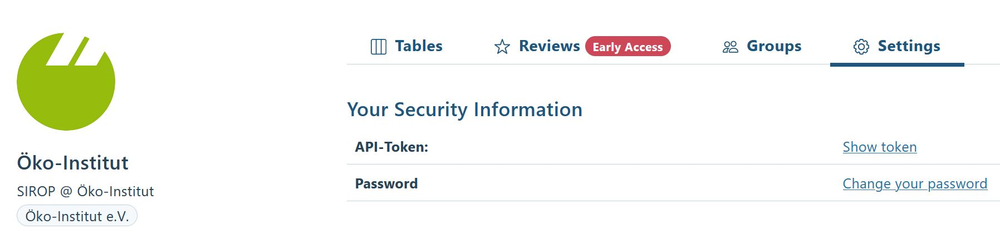
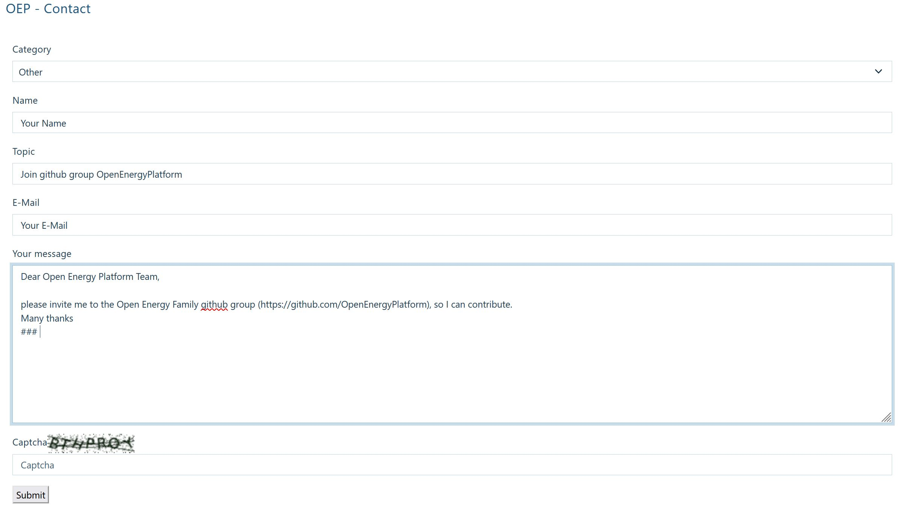

# 02 - How to get started with the Open Energy Family and Platform

You will learn how to register as a user with the Open Energy Platform (OEP) and why and how to register also with GitHub.

You can provide feedback to this course on GitHub: [https://github.com/OpenEnergyPlatform/academy/issues/164](https://github.com/OpenEnergyPlatform/academy/issues/164)

## For whom is this training and what can you learn?

:oep-icon-info: **This module is aimed at researchers, policy makers and any interested person, who**
- wants to interact as a user with the OEP
- wants to contribute to development of the OEP and Open Energy Family (OEF) members

:oep-icon-info: **After reading the sections of this training course you will**
- be able to interact as a user with the OEP
- understand why a GitHub account is needed to contribute to development
- be able to register with GitHub

## How do I get started with the OEP?

:oep-icon-info: **How do I register with the Open Energy Platform?**

To upload your data to [open energy database](https://openenergyplatform.org/dataedit/schemas) of the OEP, you require a user account on the OEP.
Here, we show you how to register with the OEP. Click the [Login](https://openenergyplatform.org/user/login/?next=/) button on the top right of the homepage and choose the option _Create a new account_.
You can also go directly to [Register](https://openenergyplatform.org/user/register). Then fill out the required fields and click on _Submit_. You will receive an activation email at the email address you provided. Please follow the instructions received in the email. After successfully activating and logging into your account, you will see your information as in the screenshot:

This includes your profile information and any data tables you have already contributed to the OEP. Under _Settings_, you will be able to view your API token, by clicking _Show token:_

The API token is necessary to make authenticated requests to the API (API = Application Programming Interface). You will use the API in case you want to connect to the OEP using programming skills.

## Why and how to register with GitHub?

:oep-icon-info: **Why register with GitHub?**

When you interact with the OEP you also interact with the Open Energy Family (OEF). The development of the OEF and OEP is a community effort that takes place openly at GitHub in the GitHub group [Open Energy Platform](https://github.com/OpenEnergyPlatform). There, the various family members of the OEF are developed in different [repositories](https://github.com/orgs/OpenEnergyPlatform/repositories). We welcome you to participate in their development. To be able to do so, you will thus need to register with GitHub. You can do so at no cost.

:oep-icon-info: **How to register with GitHub and become part of the Open Energy Family team?**

If you do not yet have a GitHub account, you need to [register with GitHub](https://github.com/join). You will then need to become a member of the group [OpenEnergyPlatform](https://github.com/OpenEnergyPlatform) by getting invited to the group. This works as follows: Get in touch via the [OpenEnergy Platform contact form](https://openenergyplatform.org/contact). Fill in the form with your request to be added to the OpenEnergyPlatform group on GitHub. An example text is provided in the screenshot below.

The response is not automated and thus not immediate. Please wait until you receive an invitation to the GitHub group.

We collected a few links to GitHub and git basics [here](https://openenergyplatform.github.io/academy/courses/05_ontology/#3-github-and-git-basics) for your first steps. 

---

## About this course

:oep-logo-sirop:

- Authors: Hannah Förster
- Copyright: [Öko-Institut](https://www.oeko.de) (2023)
- Contact: oedb@oeko.de
- License: [CC BY 4.0](https://creativecommons.org/licenses/by/4.0/deed.en)
- Attribution: Öko-Institut (2023): How to get started with the Open Energy Family and Platform.
- Last update: :oep-auto-lastupdate:
- You can provide feedback to this course on GitHub: [https://github.com/OpenEnergyPlatform/academy/issues/164](https://github.com/OpenEnergyPlatform/academy/issues/164)
