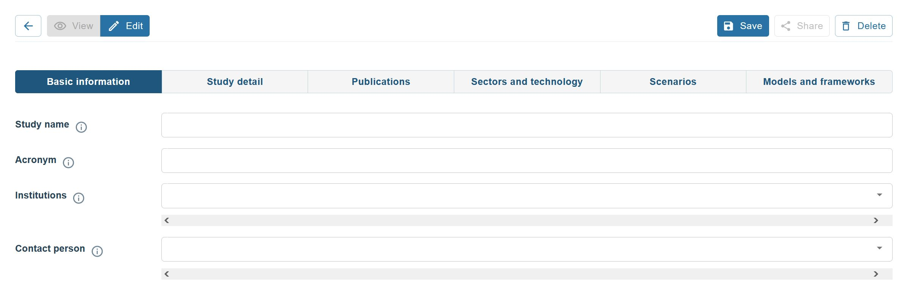
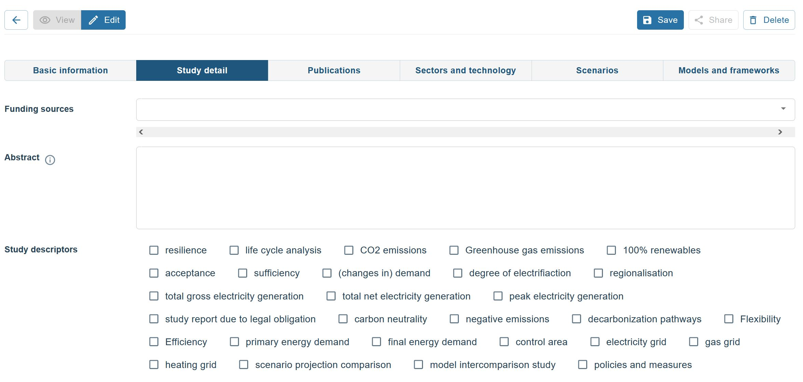
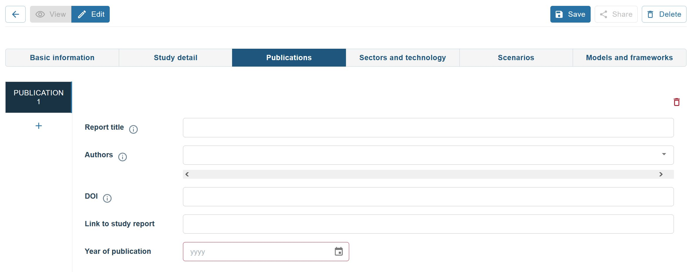
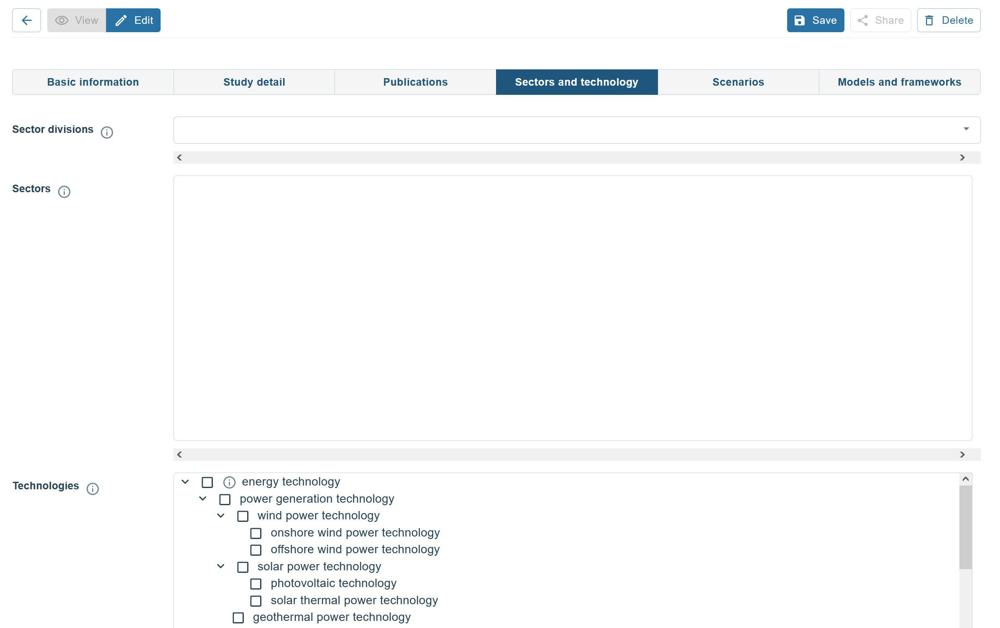
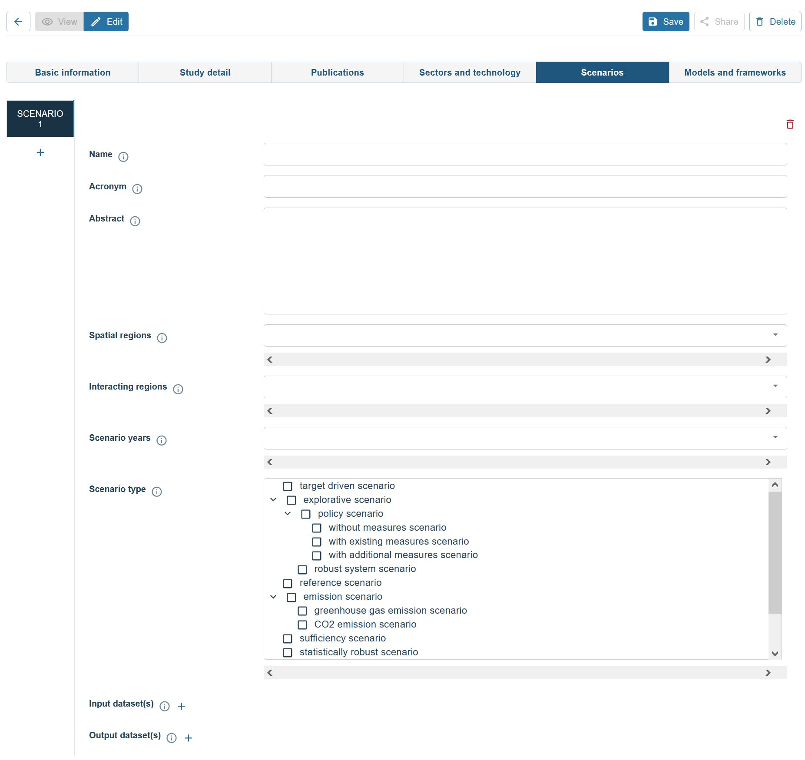
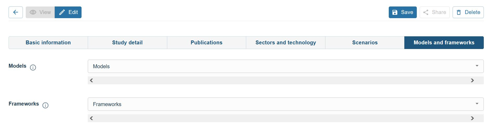

# 10 - What is a scenario bundle on the Open Energy Platform and how to create one 
THIS COURSE IS UNDER DEVELOPMENT

## For whom is this training and what can you learn?

:oep-icon-info: **This course is aimed at researchers, no matter whether you have programming skills or not, who want**

- to enhance quantitative data on the OEP by context information that goes beyond the pure metadata annotation. 

:oep-icon-info: **After reading the sections of this training course you will**

- be able to create a scenario bundle that describes context of data you have published on the OEP

## What is a scenario bundle?

Scenario bundles weave together important information about one or more scenarios. They inform about studies made based on a [scenario](https://openenergyplatform.org/ontology/oeo/OEO_00000364/), including publications (= [study report](https://openenergyplatform.org/ontology/oeo/OEO_00020012/)).

If there is quantitative input data and / or output data available for a [scenario projection](https://openenergyplatform.org/ontology/oeo/OEO_00010262/), scenario bundles provide direct links to that data. 
Scenario bundles  also inform about models (if available as a model factsheet) and frameworks (if available as a framework factsheet) that were used to project a scenario into the future.
                                                                                                                                        
In a nutshell: A scenario bundle provides you with all relevant information to understand a scenario's context and to ease a potential re-use of quantitative data for your own purposes.

## How to create a scenario bundle
* Navigate to: https://openenergyplatform.org/scenario-bundles/main
* Click the **+Create** button 
* Now you will be presented with various areas that you can populate with information about your scenario.

**Note: if you are presented with a drop-down menu in the following forms, you will see already existing entries that may fit what you want to add. Then simply choose this information. If the information (e.g. an author) is not yet available from a drop-down menu, simply start typing what you would want to enter and your information will be added to the open energy knowledge graph that works in the background. Some drop-down menus (e.g. scenario years) have fixed entries, and you won't be able to add your own information**

* **Basic information**:  Start with filling in the basic information. Scenario bundles are meant to describe scenarios that were part of a study (i.e. a project). Thus, please provide the study name, an acronym and the institutions that were involved int the study/project.

    

* **Study detail**: The study detail area helps you describe more context about the study. Please provide the funding sources, a short abstract to describe the purpose of the study. If you do find one or more fitting study descriptors, please select which ones apply to your study. 
    

* **Publications**: This area gives you room to provide all publications that were made based on the scenarios you describe. You can add more than one study by clicking the **+** button on the left. 
    

* **Sectors and technology**: Here you specify details about the [scenario projections](https://openenergyplatform.org/ontology/oeo/OEO_00010262/) you have provided in the scenario bundle. Which sectors have they projected? Please note you can hover over the (i) to receive definitions and explanations. A [**sector division**](https://openenergyplatform.org/ontology/oeo/OEO_00000368/) informs about the "method" according to which [sectors](https://openenergyplatform.org/ontology/oeo/OEO_00000367/) in a scenario are defined and made distinct from one another. Since the scenario bundles work with defintions available in the Open Energy Ontology, this area will let you choose from those sector divisions that are currently depicted by the OEO. If yours does not match any of these, please choose "other". Under **Sectors** you can then specify in more detail which sectors are depicted in your scenario projection. The ones available from the drop-down correspond to a sector divsion accordingly. If you have chosen "other" under sector divison, you do not need to choose items from the list here, unless the definition matches your definition. To check this, hover over the (i). 

    Below the sector area you will be able to provide information on which technologies are depicted in your scenario projection. Check the boxes of these technologies and use the (i) to read its defintion in the OEO. 

    

* **Scenarios**: Here you specify details about the [scenarios](https://openenergyplatform.org/ontology/oeo/OEO_00000364/) depicted in your study.  Please provide a **name** and **acronym** for your scenario and describe its characteristics in the abstract field. You can then specify the **spatial region(s)** (i.e. countries) depicted in your scenario via chossing the appropriate ones from the drop-down list. You can also do so for any regions your spatial region(s) is/are interacting in the scenario under **interacting regions**. Please choose which **scenario years** are projected in the data you provided on the OEP and which **scenario type** your scenario is. 
At the bottom you can link any input and output dataset that elong to your scenarios projection data. For this click the **+** and type in the name or IRI of your data on the OEP and then choose the corresponding dataset from the drop-down menu. Repeat for any table that you wish to connect with your scenario bundle. 

    

* **Models and frameworks**: This area is dedicated to document which **models** were used in your study to project the scenario(s) into the future. For your models to show up in the drop-down menu *models*, a model factsheet needs to be present on the OEP. So if you wish to link your models here, but they are not available as a factsheet yet, please head over to the [model factsheet area](https://openenergyplatform.org/factsheets/models/) and add it there, and then come back here. Please note that the model factsheet area is not yet a perfect place, but it will work to document a few key characteristics and provide links to documentation. The same holds true for the area where you can document the  **frameworks** that were used to project the scenario(s) you are documenting. Head over to the [framework factsheet area](https://openenergyplatform.org/factsheets/frameworks/) if yours is not yet available from the drop-down menu. 

    

At the end: do not forget to click the **Save** button. And voilà, you have created a scenario bundle that links a lot of context to data you have supplied on the OEP. Thank you for increasing transparency and re-use possibilities of that data.

## About this course

:oep-logo-sirop:

- Authors: Hannah Förster
- Copyright: [Öko-Institut](https://www.oeko.de) (2024)
- Contact: oedb@oeko.de
- License: [CC BY 4.0](https://creativecommons.org/licenses/by/4.0/deed.en)
- Attribution: Öko-Institut (2024): What is a scenario bundle on the Open Energy Platform and how to create one
- Last update: :oep-auto-lastupdate:
