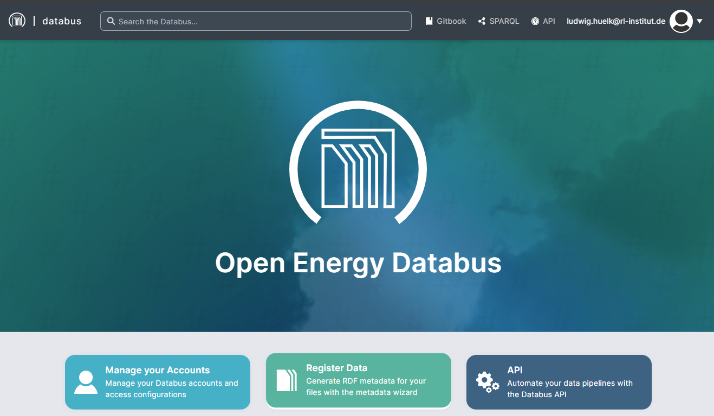
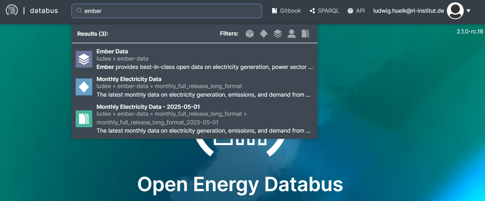
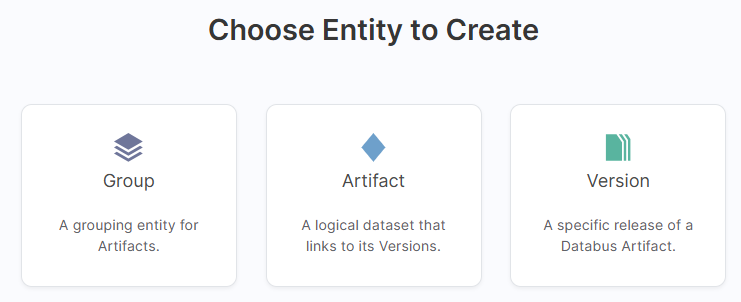
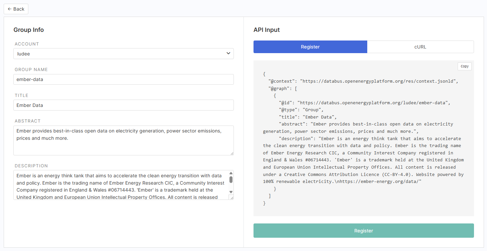
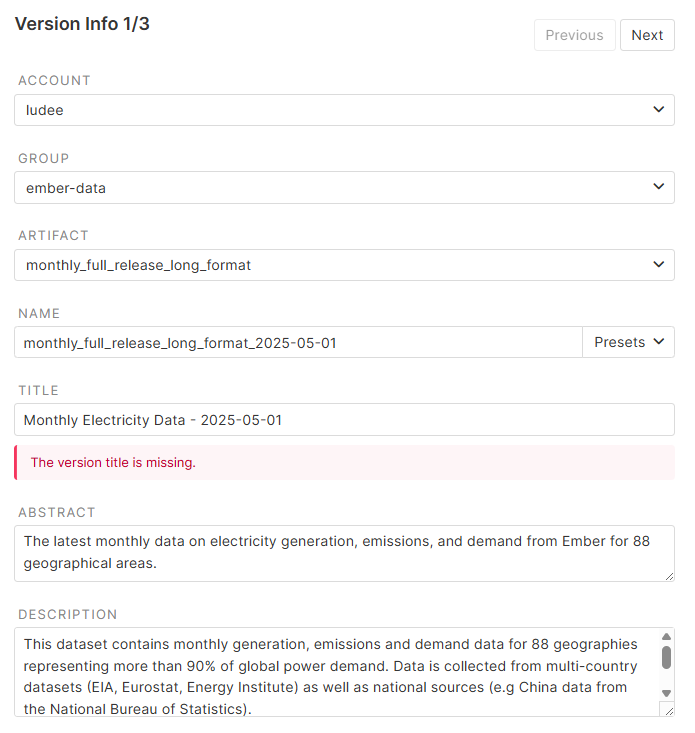
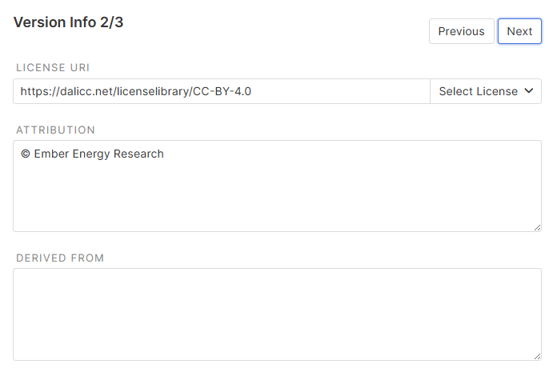
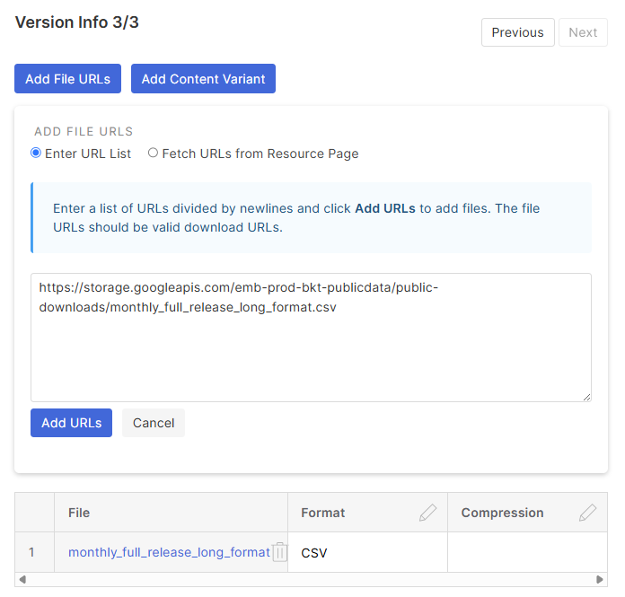

# 11 - Introduction to the Open Energy Databus

## For whom is this training and what can you learn?

:oep-icon-info: **This course is aimed at researchers, no matter whether you have programming skills or not, who want**

- to find energy data
- use data from different databases

:oep-icon-info: **After reading the sections of this training course you will**

- manually register datasets and versions on the Databus

## What is the Open Energy Databus?

The DBpedia Databus is a transformative platform for agile data integration, collaboration, and automation via a structured metadata Knowledge Graph. 
The Databus implements well-known concepts from Software Engineering such as agile rapid prototyping, build automation, test-driven development for Data Engineering. 
It connects data via a loosely-coupled bus system and a common, but extensible metadata format through state-of-the-art semantic technologies such as ontologies, SPARQL, SHACL and Linked Data.

🔥 Hot Fact: The DBpedia Databus condenses 15 years of expertise from the DBpedia Community into an accessible open-source tool.

## How to search data on the Databus?
* Navigate to: https://databus.openenergyplatform.org/
* Use the search bar, look at the newest datasets or browse most active users
* You can filter for the collection, artifact, group, user, and version 

## How to register data on the Databus?
* Navigate to:  [Register Data](https://databus.openenergyplatform.org/app/publish-wizard)
* You need to register to get a **User**

### Create a Group
* First create a **Group**
* It organises the _Artifact_ by project, institut or other
1. Select your _User_
2. The _Name_ must be lowercase
3. The _Title_ should be human-readable
4. Add short Abstract and Description
5. Publish with "Register" 

 

### Create an Artifact
* Second create an **Artifact**
* Like a dataset it organises data and versions
1. Select your _User_
2. Select your _Group_
3. The _Name_ must be lowercase
4. The _Title_ should be human-readable
5. Add short Abstract and Description
6. Publish with "Register" 

### Create a Version
* Then create a **Version**
* A table of the Artifact or updated data 
1. Select your _User_
2. Select your _Group_
3. Select your _Artifact_
3. The _Name_ must be lowercase
4. The _Title_ should be human-readable
5. Add short Abstract and Description
6. Publish with "Register" 

 

7. Select a License and add attribution
 

8. Add link to data (csv)
9. Publish with "Register" 
 

---

## About this course

:oep-logo-nfdi4energy:

- Title: Course 11 - Introduction to the Open Energy Databus
- Authors: Ludwig Hülk
- Copyright: [Reiner Lemoine Institut](https://reiner-lemoine-institut.de/)
- License: [CC BY 4.0](https://creativecommons.org/licenses/by/4.0/deed.en)
- Attribution: Reiner Lemoine Institut (2025): Introduction to the Open Energy Databus
- Link: https://openenergyplatform.github.io/academy/courses/11_energy_databus/
- Description: A description how to find and register data on the Open Energy Databus.
- ProficiencyLevel: 
- TargetGroup: 
- Keywords: OEP, databus
- Language: en
- PublicationDate: 2025-10-24
- Last update: :oep-auto-lastupdate:
- Version: 1.0
- You can provide feedback to this course on GitHub:
