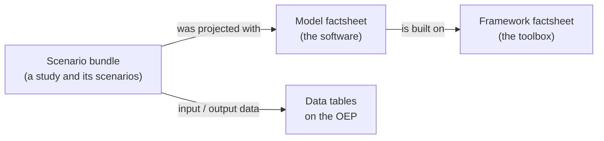

# 11 - How to describe a model or framework with a factsheet

## For whom is this training and what can you learn?

:oep-icon-info: **This course is aimed at researchers and developers, no matter whether you have programming skills or not, who want**

- to make an energy system model or a modelling framework findable and comparable,
- to give others enough context to judge whether that software fits their question.

:oep-icon-info: **After reading the sections of this training course you will**

- know what a model factsheet and a framework factsheet are, and how they differ from a scenario bundle,
- be able to create, tag, find and correct a factsheet on the Open Energy Platform.

## What is a factsheet?

A **factsheet** describes a piece of energy system analysis software in a structured way: what it is for, who maintains it, how open it is, what it can represent, and how it has been validated. Because every factsheet answers the same questions, factsheets can be compared with each other — which a project website cannot.

There are two kinds:

- a **model factsheet** describes one model,
- a **framework factsheet** describes a modelling framework, the toolbox several models may be built on.

Both live here:

- Models: <https://openenergyplatform.org/factsheets/models/>
- Frameworks: <https://openenergyplatform.org/factsheets/frameworks/>

### How this differs from a scenario bundle

A factsheet describes **software**. A [scenario bundle](10_scenario_bundle.md) describes a **study and its scenarios** — and points at the model that produced them.

Both are reached under `/factsheets/`, which is a historical accident — they are separate things. If you want to publish a study, you want a scenario bundle. If you want your software to be findable, you want a factsheet.

## Before you start

You need a free OEP account. Everything below is visible to everyone, but creating and editing requires you to be logged in.

It saves time to collect these first:

- the software's name and acronym, and a link to its website and source code,
- its licence, and whether the source is publicly available,
- the institutions and people behind it, and a contact address,
- what it models: sectors, energy carriers, technologies, geographic and time resolution,
- the mathematical approach, and how the model has been validated,
- one or two publications that used it.

You do **not** have to fill everything in at once. A factsheet can be edited at any time, by you or by a colleague.

## Create a factsheet

<!-- SCREENSHOT 11_overview: the model factsheet overview at /factsheets/models/,
     logged in, showing the table and the right-hand sidebar with the
     "Add Model" button visible. -->

* Navigate to <https://openenergyplatform.org/factsheets/models/> (or the frameworks overview, for a framework).
* Log in, then click **Add Model** in the sidebar on the right.
* The form is grouped into sections. Work through them top to bottom; only the name is required to save.

<!-- SCREENSHOT 11_form_basic: the "Basic Information" section of the add form,
     with acronym, institutions and contact e-mail filled in as an example. -->

* **Basic information**: the name, acronym, the institutions and authors behind the software, a contact address, and the website. This is what people see first in the overview table.

* **Openness**: the licence, whether the source code is available, and where. If the licence is not in the list, pick "other" and name it in the free-text field beside it.

* **Software**: the language it is written in, any external optimiser it needs, and whether it has a graphical interface.

* **Coverage** (models only): the sectors, energy carriers and technologies the model represents, and its geographic and time resolution. These are the fields people filter and compare on, so they are worth the effort.

* **Mathematical approach**: the model class, the objective, and how uncertainty is handled.

* **Validation and usage**: how the model has been checked, and publications that used it.

:oep-icon-info: **Long free-text fields are shortened to about twelve words in the overview table.** The full text is kept and shown on the factsheet's own page — write for the detail page, not for the table.

### Add tags

Open the **Tags** tab and select the tags that describe your software. The tab shows a live count of what you have selected, and **Remove all tags** clears the selection.

<!-- SCREENSHOT 11_tags: the Tags tab of the edit form, with three tags
     selected and the selection count visible. -->

:oep-icon-info: **Tags are one shared vocabulary.** The same tags are used for data tables on the platform. Choose existing tags where they fit rather than creating near-duplicates — that is what makes the filter useful for everyone.

### Save

Click **Save** at the bottom of the form. You are taken to the finished factsheet.

If something required is missing, the form comes back with the problem marked **and your input intact**, including your tag selection.

## Find, filter and share

<!-- SCREENSHOT 11_filter: the overview with two tags selected in the sidebar
     filter, the table narrowed, and the browser address bar showing ?tags=... -->

* The **sidebar filter** lists the tags actually in use. Selecting two tags narrows the table to factsheets carrying **both**.
* The filter is written into the page address, so you can **bookmark or share a filtered view** and it comes back the way you left it.
* The **search box** searches every field, including the columns that are not currently shown.
* The **field groups** in the sidebar switch additional columns on. The table starts with eight columns and loads the rest the first time you need them.
* **Download CSV** gives you the full records as a file, and respects the tag filter you have applied.

## Correct or remove a factsheet

**Editing is open.** Any logged-in user may improve any factsheet — a wrong licence, a dead link, a missing publication. This is deliberate: factsheets are a community resource, and the software they describe keeps changing.

**Deleting is limited.** For **seven days after a factsheet was created**, any logged-in user may delete it. After that, only administrators can.

:oep-icon-info: **Deleting cannot be undone.** There is no version history and no recycle bin. If a factsheet is wrong, correct it — do not delete and recreate it. If you created a duplicate by accident, that is exactly what the seven-day window is for.

## Where to get help

:oep-icon-mail: If you are unsure whether your software should be one factsheet or several, or whether it is a model or a framework, ask before creating: <contact@openenergyplatform.org>

---

<!--
MAINTAINER TODO before publishing — screenshots.

Five are marked inline above as "SCREENSHOT <name>". Take them logged in, on a
wide window, and crop to the region described. Save as
docs/data/img/<name>.JPG (the convention used by course 10) and replace each
comment with, for example:

    

  11_overview     the models overview, sidebar "Add Model" visible
  11_form_basic   the add form's Basic Information section, example values
  11_tags         the Tags tab, three tags selected, selection count visible
  11_filter       overview with two tags filtered, address bar showing ?tags=
  (optional) a finished factsheet detail page, for the "Save" step

Also: this course is not yet linked from the platform. Once it is published,
add `tutorials_factsheets` to EXTERNAL_URLS in oeplatform/settings.py and link
it from the factsheet overview and edit pages, the way the upload wizard links
to its course.
-->
