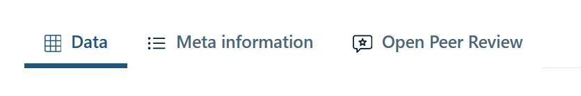
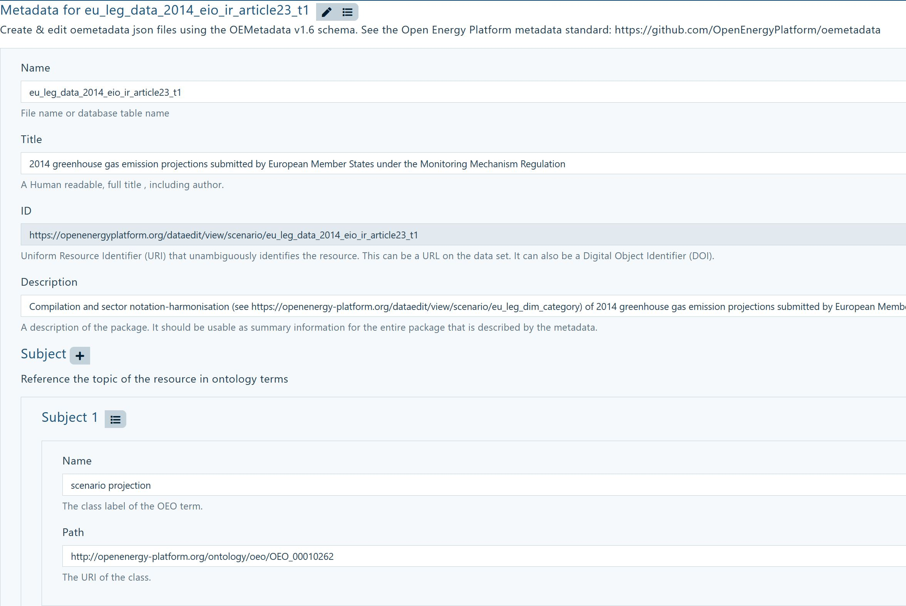

# Beginners Guide: How to upload data to the OpenEnergy Platform

<!-- keep img below title and without align="left"  -->

# About this guide

This document describes how to upload data to the
[OpenEnergy Platform](https://openenergyplatform.org/) (OEP) using
[Python](https://www.python.org/) and the
[REST-API](https://en.wikipedia.org/wiki/Representational_state_transfer) as
well as a description on how to initiate the review process of that data.

Several steps are needed to contribute actively to the platform. Some of them
you only need to do once to get started. The steps described in this document
are the following:

- **(once)** Register at the OpenEnergy Platform

- **(once)** Register at GitHub and get invited to the OpenEnergy Platform Group

- Create data table(s) and upload data table(s)

- Create metadata and upload metadata to Github

- Initiate review

- Create factsheets

# 1. Things you only need to do once

## 1.1. Register at the OpenEnergy Platform

- Registration

  - Click [Login](https://openenergyplatform.org/user/login/?next=/) button on
    Homepage and choose the option **Create a new account.**

  - OR: go directly to <https://openenergyplatform.org/user/register>

  - Fill out the required fields and click on **Submit.**

  - You will receive an activation email, sent to your email address.

  - Follow the instructions received in the email.

  - After successfully activating and logging into your account, you will be
    able to view your user information.

  - API-Token

    - The API token is necessary to make authenticated requests to the API.

    - After you logged into the OEP, click the member icon in the upper right
      corner of the page

    - You can find your API-Token under **Your Security Information** by
      clicking on **Show token:**

    

## 1.2. Register at GitHub and get invited to OpenEnergyPlatform Group

- If you do not yet have a GitHub account, you need to register:
  <https://github.com/join>.

- You will then need to become a member of the group OpenEnergyPlatform:
  <https://github.com/OpenEnergyPlatform> by getting invited to the group. This
  works as follows:

  - Get in touch via the contact form on the OpenEnergyPlatform:
    <https://openenergyplatform.org/contact/>.

  - Fill in the form with your request to be added to the OpenEnergyPlatform
    group on GitHub. An example text is provided in the screenshot below.

    

  - A response will not be immediate. Please wait until you receive an
    invitation to the GitHub group. Only then you will be able to upload
    metadata and initiate data review.

# 2. Things you will need to do any time you contribute new data and metadata

## 2.1. Create and upload data table(s)

_Prerequisite for this step is that you are a registered user on
openenergyplatform.org_

The preferred way to create and upload data tables is via the [API](../01_api/)

If you do not want to upload tables via the API, you can
do so using the [CSV-Wizard](wizard.md)

## 2.2. Create metadata

You can create metadata that describes the context of your data in various ways.
The easiest way is to navigate to the Meta information attached your table and
click the Edit button:  You
will then be presented with a set of fields that need and can be completed, see
the display below:

Info: The .json specification of the metadata can be found
[here](https://github.com/OpenEnergyPlatform/oemetadata/blob/master/metadata/latest/metadata_key_description.md).

# 3. Complete your contribution

This document described how to upload data and metadata to the OpenEnergy
Platform. For your contribution to become even more useful to other users of the
platform and as further support for the community, we encourage you to create
factsheets to describe the data you provided and their context in more detail.

## 3.1. Create Factsheets

- The drop-down menu **Scenario Bundles** shows you the 3 different Factsheet
  categories.

- Select a suitable factsheet category from the drop-down menu

  - Scenario Bundle: this is the place that ties together all the information
    that you may want to describe regarding the data you have just uploaded. You
    can provide information on the scenario characteristics, the study reports
    that deal with your data, the sectors and technologies depicted, the models
    and frameworks used. Use this factsheet to enrich your contribution.

  - Frameworks: use this factsheet to add information about the fundamental
    structure or toolbox to build a model, e.g. TIMES. Under **Scenario Bundle**
    you can then attach such a framework via a drop-down menu.

  - Models: to describe a model that has been used to run a scenario; ideally
    this relates to a scenario for which you have uploaded data to the OEP.
    Under **Scenario Bundle** you can then attach models via a drop-down menu to
    your scenario.

---

## About this tutorial

:oep-logo-sirop:

Authors: Hannah Förster, Victoria Liste, Christian Winger (all Öko-Institut).
Copyright: Öko-Institut (2021). License:
[CC BY 4.0](https://creativecommons.org/licenses/by/4.0/deed.en). Attribution:
Öko-Institut: Beginners Guide: How to upload data to the OpenEnergy Platform and
initiate the review process. Last update: :oep-auto-lastupdate:

---
