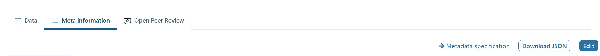

# Beginners Guide: How to upload data to the OpenEnergy Platform

# About this guide

This document describes how to upload data to the [OpenEnergy Platform](https://openenergyplatform.org/) (OEP) using [Python](https://www.python.org/) and the [REST-API](https://en.wikipedia.org/wiki/Representational_state_transfer) as well as a description on how to initiate the review process of that data.

Several steps are needed to contribute actively to the platform. Some of them you only need to do once to get started. The steps described in this document are the following:

- **(once)** Register at the OpenEnergy Platform

- **(once)** Register at GitHub and get invited to the OpenEnergy Platform Group

- Create data table(s) and upload data table(s)

- Create metadata and upload metadata to Github

- Initiate review

- Create factsheets

# 1. Things you only need to do once

## 1.1. Register at the OpenEnergy Platform

- Registration

  - Click [Login](https://openenergyplatform.org/user/login/?next=/) button on Homepage and choose the option **Create a new account.**

  - OR: go directly to <https://openenergyplatform.org/user/register>

  - Fill out the required fields and click on **Submit.**

  - You will receive an activation email, sent to your email address.

  - Follow the instructions received in the email.

  - After successfully activating and logging into your account, you will be able to view your user information.

  - API-Token

    - The API token is necessary to make authenticated requests to the API.

    - After you logged into the OEP, click the member icon in the upper right corner of the page

    - You can find your API-Token under **Your Security Information** by clicking on **Show token:**

    


## 1.2. Register at GitHub and get invited to OpenEnergyPlatform Group

- If you do not yet have a GitHub account, you need to register: <https://github.com/join>.

- You will then need to become a member of the group OpenEnergyPlatform: <https://github.com/OpenEnergyPlatform> by getting invited to the group. This works as follows:

  - Get in touch via the contact form on the OpenEnergyPlatform: <https://openenergyplatform.org/contact/>.

  - Fill in the form with your request to be added to the OpenEnergyPlatform group on GitHub. An example text is provided in the screenshot below.

    

  - A response will not be immediate. Please wait until you receive an invitation to the GitHub group. Only then you will be able to upload metadata and initiate data review.

# 2. Things you will need to do any time you contribute new data and metadata

## 2.1. Create and upload data table(s)

_Prerequisite for this step is that you are a registered user on openenergyplatform.org_

**OPTION: CSV WIZARD:** If you do not want to upload tables via the API, you can do so using the CSV-Wizard. Please consult [this tutorial](wizard.md) and **then continue reading [Section 2.2](https://openenergyplatform.github.io/academy/tutorials/99_other/beginners_guide/#2-things-you-will-need-to-do-any-time-you-contribute-new-data-and-metadata)**

_Please note: code snippets below are shown to highlight specific instances of a sequence of code. You find a complete sample code that you can copy & paste and try under [2.1.4_ Complete code for one example](https://openenergyplatform.github.io/academy/tutorials/99_other/beginners_guide/#214-complete-code-for-one-example)_

- The REST-API can be used with any language that can make HTTP(s) requests.

- Most requests require you to add an authorization header: Authorization: **Token API_TOKEN**, where you substitute **API_TOKEN** with your token as described above.

- All requests (and most responses) will use json data as payload (the actual data content of the request).

- In the examples below, we use python and the [requests package](https://2.python-requests.org/en/master/). All requests will use a requests session with the authorization header.

```python
    import requests
    API_URL = 'https://openenergyplatform.org/api/v0'
    session = requests.Session()
    session.headers = {'Authorization': 'Token %s' % API_TOKEN}
```

- The requests in the following sections use roughly the same pattern:

- Prepare your request payload as a json object

- Prepare your request url

- Send your request using the correct [verb](https://www.restapitutorial.com/lessons/httpmethods.html) (get, post, put, delete)

- Check if the request was successful

### 2.1.1. Create a new table

- You will need to create the tables at first in the **model_draft** topic. This topic is used for data that is still preliminary and subject to changes. After a successful review later, the table will be moved to the final target topic.

- You need to specify the name of the new table (TABLE_NAME), which should be a valid PostgreSQL table name, without spaces, ideally only containing lower case letters, numbers and underscores.

- You also need to specify names and data types of your columns, which also must be [valid postgres data types](https://www.postgresql.org/docs/current/datatype.html).

```python
    # prepare request payload
    data = {
     'query': {
      'columns': [
       {
        'name': 'id',
        'data_type': 'bigserial'
       },
      # add more columns here
      ],
      'constraints': [
       {
        'constraint_type': 'PRIMARY KEY',
        'constraint_parameter': 'id'
       }
      ]
     }
    }
    # prepare api url
    url = API_URL + '/topic/model_draft/tables/' + TABLE_NAME
    # make request and check using PUT
    res = session.put(url, json=data)
    res.raise_for_status() # check: throws exception if not successful
```

### 2.1.2. Upload data

- To upload data, you must first load it into a json structure as a [list](https://www.w3schools.com/python/python_lists.asp) representing data rows, each of which is a [dictionary](https://www.w3schools.com/python/python_dictionaries.asp) mapping column names to values.

- In the example, we will use [pandas](https://pypi.org/project/pandas/) to read data from an Excel workbook (WORKBOOK, WORKSHEET) into a [data frame](https://pandas.pydata.org/pandas-docs/stable/reference/api/pandas.DataFrame.html) which we will then convert into a json object. Please note that this step will most likely require some modification to accommodate the specifics of your input data.

- In addition to that, at the end, you need to load your data into the specified json structure.

- After that, the data can be uploaded making a request to the API:

```python
    # load data into dataframe, convert into json
    df = pd.read_excel(WORKBOOK, WORKSHEET)
    records = df.to_json(orient='records')
    records = json.loads(records)
    # prepare request payload
    data = {'query': records}
    # prepare api url
    url = API_URL + '/topic/model_draft/tables/' + TABLE_NAME + '/rows/new'
    # make request
    res = session.post(url, json=data)
    res.raise_for_status() # check
```

- You can repeat this if you want to upload your data in multiple batches.

### 2.1.3. Starting over: Deleting your table

- While the table is still in the model draft, you can always delete the table and start over:

```python
    # prepare api url
    url = API_URL + '/topic/model_draft/tables/' + TABLE_NAME
    # make request
    res = session.delete(url)
    res.raise_for_status() # check
```

### 2.1.4. Complete code for one example

- This is an example code that you can copy and paste to execute the workflow we have described above. The workflow described does not take into account any specific settings you will need to make in your personal work environment. It can, however, simply be executed in the python prompt.

- Let's say you have an Excel workbook named **CountryValues.xlsx**, with a worksheet named **data** as depicted below:

  

- Your API-Token is **xxxxxxxxxxxxxxxxxxxxxxxxxxxxxxxxxxx**, and your desired table name shall be `my_example_table`. Please note that, while it is highly unlikely, there may already exist a table with this particular name created by another person. If this is the case, the example below will not work. Then, please choose another name for your table and substitute every instance with 'my_example_table' below with the name you have chosen.

- Save the example code below as `example.py` in the same folder as the Excel workbook, then [open a command line](https://www.lifewire.com/how-to-open-command-prompt-2618089), [navigate to the folder](https://www.wikihow.com/Change-Directories-in-Command-Prompt), and type `python3 example.py`

```python
    import json
    import requests
    import pandas as pd
    API_TOKEN = 'xxxxxxxxxxxxxxxxxxxxxxxxxxxxxxxxxxx'
    TABLE_NAME = 'my_example_table'
    API_URL = 'https://openenergyplatform.org/api/v0'
    session = requests.Session()
    session.headers = {'Authorization': 'Token %s' % API_TOKEN}
```

```python
    # --------------------------------------
    # delete table (in case it already exists)
    # --------------------------------------
    # prepare api url
    url = API_URL + '/topic/model_draft/tables/' + TABLE_NAME
    # make request
    res = session.delete(url)
```

```python
    # --------------------------------------
    # create table
    # --------------------------------------
    # prepare request payload
    data = {'query': {
     'columns': [
     {
      'name': 'id',
      'data_type': 'bigserial'
     },
     {
      'name': 'country',
      'data_type': 'varchar'
     },
     {
      'name': 'year',
      'data_type': 'int'
     },
     {
      'name': 'value',
      'data_type': 'float'
     }
     # add more columns here
     ],
     'constraints': [
      {'constraint_type': 'PRIMARY KEY', 'constraint_parameter': 'id'}
     ]
    }}
    # prepare api url
    url = API_URL + '/topic/model_draft/tables/' + TABLE_NAME + '/'
    # make request and check using PUT
    res = session.put(url, json=data)
    res.raise_for_status() # check: throws exception if not successful
```

```python
    # --------------------------------------
    # read data
    # --------------------------------------
    # load data into dataframe, convert into json
    df = pd.read_excel('CountryValues.xlsx', 'data')
    records = df.to_json(orient='records')
    records = json.loads(records)
```

```python
    # --------------------------------------
    # upload data
    # --------------------------------------
    # prepare request payload
    # 'records' is a list of dictionaries (field name: value)
    data = {'query': records}
    # prepare api url
    url = API_URL + '/topic/model_draft/tables/' + TABLE_NAME + '/rows/new'
    # make request
    res = session.post(url, json=data)
    res.raise_for_status()  # check
```

```python
    # --------------------------------------
    # read data (to check if everything was ok)
    # or search for your table here:
    # https://openenergyplatform.org/dataedit/view/model_draft/tables/my_example_table
    # --------------------------------------
    # prepare api url
    url = API_URL + '/topic/model_draft/tables/' + TABLE_NAME + '/rows'
    # make request
    res = session.get(url)
    print(res.json())
```

```python
    # --------------------------------------
    # delete table (because it was just a test)
    # --------------------------------------
    # prepare api url
    url = API_URL + '/topic/model_draft/tables/' + TABLE_NAME
    # make request
    res = session.delete(url)
    res.raise_for_status()  # check
```

## 2.2. Create metadata

You can create metadata that describes the context of your data in various ways. The easiest way is to navigate to the Meta information attached your table and click the Edit button:

You will then be presented with a set of fields that need and can be completed, see the display below:


Info: The .json specification of the metadata can be found [here](https://github.com/OpenEnergyPlatform/oemetadata/blob/master/metadata/latest/metadata_key_description.md). 

# 3. Complete your contribution

This document described how to upload data and metadata to the OpenEnergy Platform. For your contribution to become even more useful to other users of the platform and as further support for the community, we encourage you to create factsheets to describe the data you provided and their context in more detail.

## 3.1. Create Factsheets

- The drop-down menu **Scenario Bundles** shows you the 3 different Factsheet categories.

- Select a suitable factsheet category from the drop-down menu

  - Scenario Bundle: this is the place that ties together all the information that you may want to describe regarding the data you have just uploaded. You can provide information on the scenario characteristics, the study reports that deal with your data, the sectors and technologies depicted, the models and frameworks used. Use this factsheet to enrich your contribution. 

  - Frameworks: use this factsheet to add information about the fundamental structure or toolbox to build a model, e.g. TIMES. Under **Scenario Bundle** you can then attach such a framework via a drop-down menu. 

  - Models: to describe a model that has been used to run a scenario; ideally this relates to a scenario for which you have uploaded data to the OEP. Under **Scenario Bundle** you can then attach models via a drop-down menu to your scenario. 


---

## About this tutorial

:oep-logo-sirop:

Authors: Hannah Förster, Victoria Liste, Christian Winger (all Öko-Institut). 
Copyright: Öko-Institut (2021). 
License: [CC BY 4.0](https://creativecommons.org/licenses/by/4.0/deed.en). 
Attribution: Öko-Institut: Beginners Guide: How to upload data to the OpenEnergy Platform and initiate the review process. 
Last update: :oep-auto-lastupdate:

---
