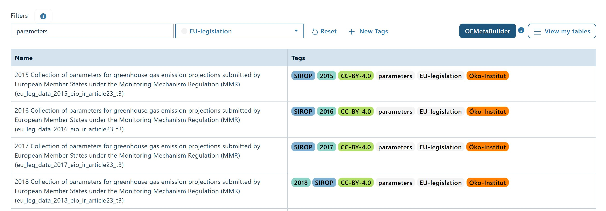

# Find data on the OEP

The OEP currently offers two possibilities to **search for data tables**: **free text and tags**. You can use either one of these, or combine them for your search. **Together, they make up filters.** You can **either search across all topics** by navigating to [topics](https://openenergyplatform.org/dataedit/schemas)
**or within a desired topic**, by directly navigating to it, for example the [scenario topic](https://openenergyplatform.org/dataedit/view/scenario): Use the **Search bar to enter free text**, and/or **click on any of the desired tags** to create your search query. When you have selected the desired free text and / or tags, the search will be performed automatically.   

The example below exemplarily shows you how to use free-text (_parameters_) and tags (_EU-legislation_) together and an excerpt of the results in the scenario topic. Please note that when you select more than one tag only those tables will be shown in the list of results which contain all the chosen tags.

---

## About this tutorial

:oep-logo-sirop:

- Authors: Hannah Förster
- Copyright: [Öko-Institut](https://www.oeko.de) (2022)
- License: [CC BY 4.0](https://creativecommons.org/licenses/by/4.0/deed.en).
- Attribution: Öko-Institut (2022): Find data on the OEP. Last update: :oep-auto-lastupdate:

---
