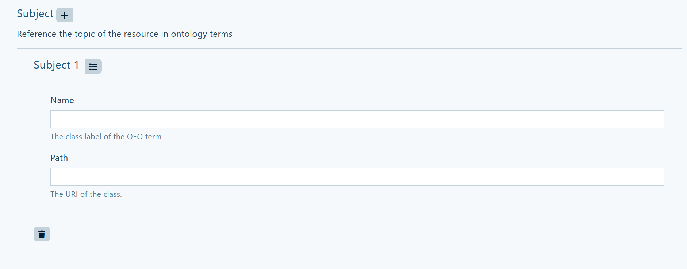
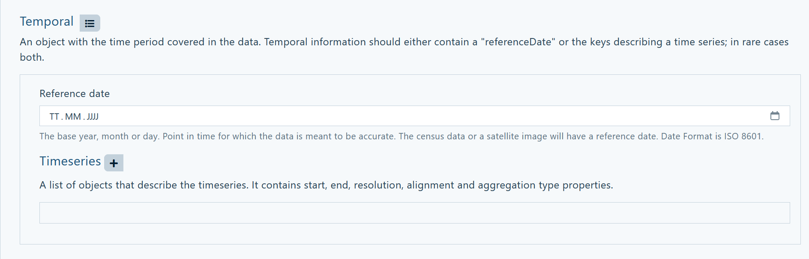

# OEMetaData

<!-- keep img below title and without align="left"  -->

## Learnings
This tutorial will wnable you to:

- know what OEMetaData are
- create and modify OEMetaData

## Introduction

This tutorial will always refer specifically to OEMetaData (the Metadata used on the [Open Energy Platform](https://openenergyplatform.org/) (OEP)). For a more general overview please see the [course on Metadata](https://openenergyplatform.github.io/academy/courses/07_metadata/).

## Important Information on OEMetaData

- OEMetaData follow the specifications of one of the releas versions of the OEP. At the time v1.6.0, soon 2.0.0.
- OEMetaData are always a JSON-file, which can refer to other elements, e.g. websides, classes from the [Oepen Energy Ontology](https://openenergyplatform.org/viewer/oeo/) (OEO) etc.. The OEMetaData in version v1.6.0 always describes one whole dataset to a table. 
- OEMetaData follow a pattern. Find the key descriptions for the newest version of the OEMetaData on [GitHub](https://github.com/OpenEnergyPlatform/oemetadata/blob/develop/metadata/v160/metadata_key_description.md).
- There can always only be one version of the OEMetaData dataset on the OEP! Meaning that the livetime of OEMetaData is critical because othervise there might be multiple datasets to one table. In order for that not to happen the published OEMetaData for a published table on the OEP stay like this until there is a new version of the OEMetaData dataset. (For more information on the publishing process see [this course](https://openenergyplatform.github.io/academy/courses/04_upload/).)  
- The minimal requirement to the OEMetaData in order to exist on the OEP to an existing table is a filled out ID field. Here the URL of the tale must be incerted. For all other fields please follow the [key descriptions](https://github.com/OpenEnergyPlatform/oemetadata/blob/develop/metadata/v160/metadata_key_description.md) or see the information provided in the OEMetaDataBuilder.

## How to create OEMetaData

There are essintially two ways of creating OEMetaData. Both can be done with and without an already on the OEP existing table.

**Manually creating OEMetaData using the OMI**
You can manually create a OEMetaData dataset as a JSON-file on your computer. This might be useful if you want to create multiple OEMetaData datasets for tables, where some fields will be filled out the same. Then it is much easier to copy and paste the entries. It is possible to manually create OEMetaData and later on modify them via the OEMetaDataBuilder.
Note: Should only be done while using the [OpenMetadataIntegration](https://github.com/OpenEnergyPlatform/omi) (OMI). This way might result in faulty OEMetaData because the guidelines from the OEMetaDataBuilder are not provided while creating the dataset(s).

**Creating OEMetaData using the OEMetaDataBuilder**
On the OEP there is a tool to create your OEMetaData directly on the platfrom. It is called [OEMetaDataBuilder](https://openenergyplatform.org/dataedit/oemetabuilder/) and can be used when there already exist a table on the OEP for which you want tor create the OEMetaData or as standalone version when no table for which the OEMetaData dataset is for exist on the OEP.

## How to use the OEMetaDataBuilder

You can find the [OEMetaDataBuilder](https://openenergyplatform.org/dataedit/oemetabuilder/) on the OEP under [Database](https://openenergyplatform.org/dataedit/schemas) by clicking on `OEMetaBuilder` in the upper right corner. 

Then the OEMetaDataBuilder opens and you can see all the fields. Right next to the headline `Create new Metadata` there are two buttons; With the first one (the pen) you can edit and/or copy the code on which this page is based on in a popup window. With the second (the menu) you can choose which fields will be shown or hidden by clicking on them in the list in the popup window. Whenever there is a such a `menu` button next to a headline it enables you to choose which fields will be shown or hidden. Beneath all fields is a description of what values and information may be filled in the field above. For more detailed information please see the [key descriptions](https://github.com/OpenEnergyPlatform/oemetadata/blob/develop/metadata/v160/metadata_key_description.md). 
In order for the OEMetaData dataset to exist on the OEP the ID field must be filled out. You can also give a name, title and description to your OEMetaData. If you create OEMetaData to an already existing table some fields will be filled automatically once you filled in the ID of the table. This makes it easier for you and minimizes the possibles errors.

Under `Subject` you can provide subjects which describe your data. In the `Name`-field please provide the human readable name of the subject, e.g. energy. In the `Path`-field please provide the corresponding URL to the OEO, e.g. https://openenergy-platform.org/ontology/oeo/OEO_00000150. You can add subjects by clicking on the `+` right next to the headline `Subject`. Note: Subjects help other users to find you data and know what it is about.

You can provide language tag(s) for all languages used in your data, inculding the table and the OEMetaData dataset. You can add multiple languages by the `+` right next to the headline `Language`. Note: Please use the required standard (IETF (BCP47)). 

Additionally to the Subjects you can also provide `Keywors`. These don't have to be defined in the OEO, but can help to describe the content of your data even more precisly.

You can give context to your data, e.g. a research project. This makes your data more comprehendable and traceable for others.

You can specify the spatial context of your data, e.g. the region in which a research was done.

You can also define the time of your data. Either a reference date or a time span. 

You can add a `Timeseries` by clicking on the `+` next it. There you can specify start, end and resolution of the series and information about how the data is implemented in the table. You can add multiple timeseries if neccessarry.

You can provide information on your `Sources`, `Licenses`, `Contributers` and `Recourses`. You can add each of them by clicking on the `+` next to the headline.

You can list your sources by providing a human readable title, a description of the source and the path to the source as URL. You can add multiple sources.

You can also provide the license of each source by providing the SPDX identifire, a human readable name as well as a path to the license and further information.

You may provide information about the contributors of your data. You can add multiple contributors and add details about their contribution.

You can also annotate the data in your table. This helps to make the data in your table comparable to others because it makes a connection between coulumns and/or fields to classes in the OEO. In order to do so you must add resource(s) by clicking on the `+` next to the headline `Recourses`. For all resources you must add an unique name. Ich bin etwas verwirrt und weiß nicht, ob ich das folgende richtig beschreibe!

You can specify the content of a field in your table by identifiying the field, giving its description and data type.

The important step of making the connection between the entries in your table and the classes of the ontology happens now by providing the human readable term and the path to the OEO.

You can also provide a class of the OEO for entries of a whole column. By giving the name of the column and the name and path of the OEO class as well as the unit. Of course you can do this for multiples rows by clicking on the `+` right next to the headline `ValueReferences`.

You can also give a `Primary Key` which uniquely identifies each row of your table.

You can also refer to an other table by giving a `Foreign Key`.

If you want to reference another table  you can provide the foreign table in the `Reyource`-field and then specifying which column should be referencced in the `Field` below.

At the end you can provide an explantation of your data in terms defined by the OEO and a URI via the DBpedia Databus.

You can submit your OEMetaData if there already exist a table for your dataset. You can always download the dataset as a JSON-file or cancel the process using the buttons at the very end of the page.
