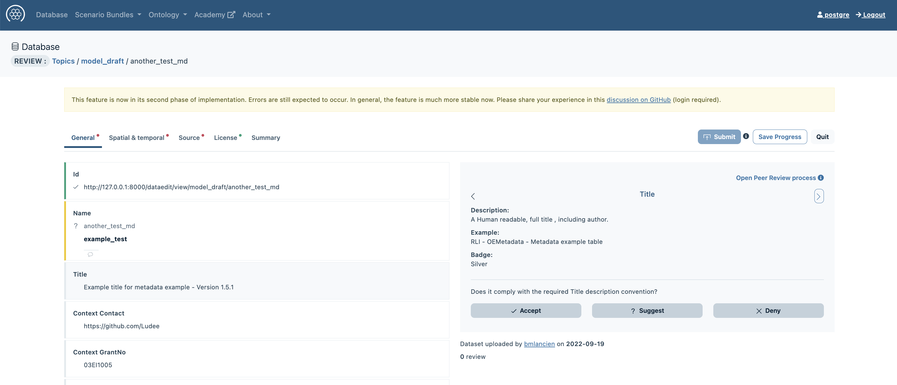
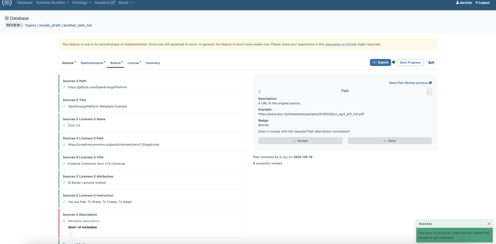
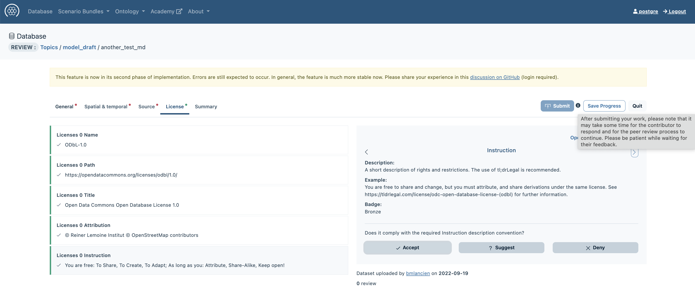
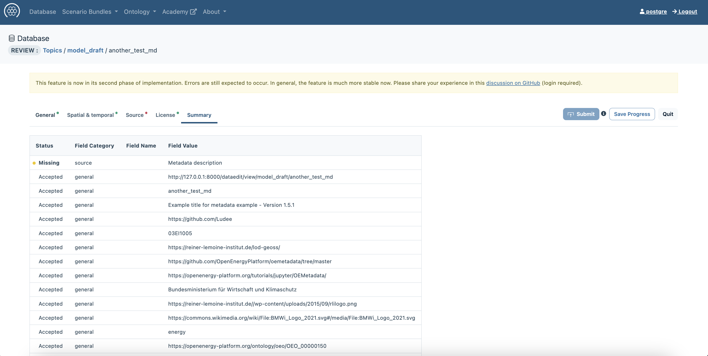
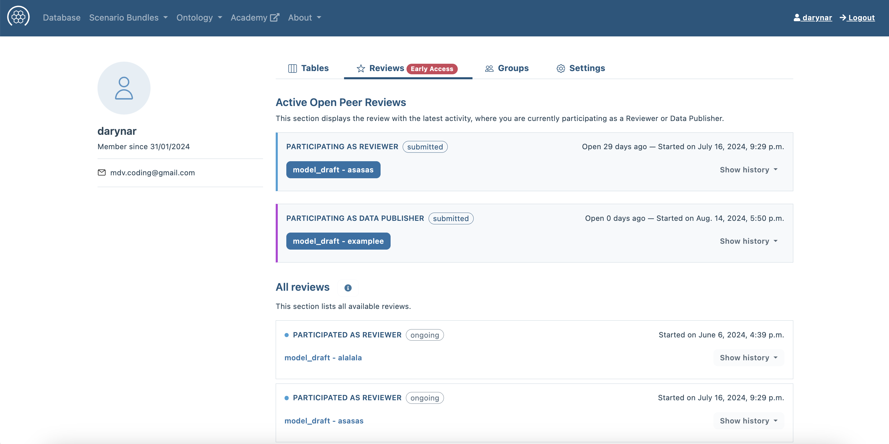
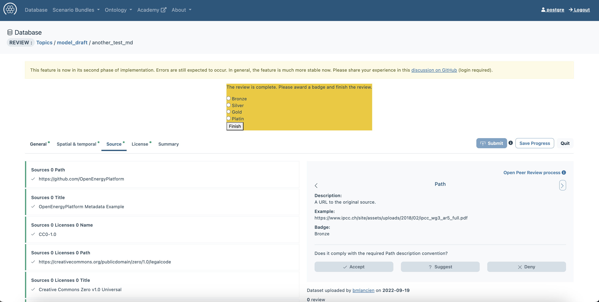
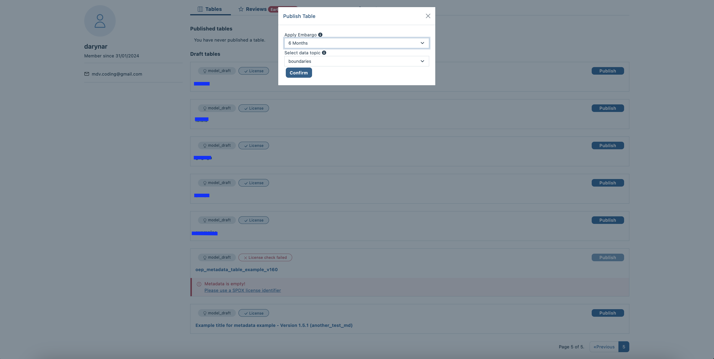

# Tutorial - Open Peer Review for OEMetadata

<!-- keep img below title and without align="left"  -->

## Learnings

This tutorials will enable you to:

- Complete every step in the workflow of the Review Process
	- Initiation
	- Review
	- Completion

## Requirements

- OEP Account
- a table or dataset uploaded to the [OpenEnergyPlatform](https://openenergyplatform.org/) (OEP)
- metadata for that table or dataset

## Introduction

This course will teach you step-by-step how the open peer review process on the OEP works. For a more general overview of the peer review process have a look at the course [09 - Open Peer Review](https://openenergyplatform.github.io/academy/courses/09_peer_review/).

## Metadata Upload

In a first step, a contributer [uploads metadata](https://openenergyplatform.org/dataedit/wizard/) to the [OpenEnergyPlatform](https://openenergyplatform.org/) (OEP). Note that a prerequisite to upload metadata is an existing table. We are going to call this person metadata owner from now on. If you are unsure how to create and upload metadata, have a look at [this tutorial](https://openenergyplatform.github.io/academy/tutorials/99_other/beginners_guide/#22-create-metadata). The metadata owner has to make sure that the metadata include a license. They can also apply an embargo period of 6 months or 1 year if they need to. The metadata are automatically uploaded to the [model_draft](https://openenergyplatform.org/dataedit/view/model_draft) schema.

## Initiation of the Review Process

Once the metadata are publicly accessible in the [model_draft](https://openenergyplatform.org/dataedit/view/model_draft) section, anyone (except the metadata owner) can start a review by going to the 'Open Peer Review' View (next to 'Meta information') and clicking on 'Start Open Peer Review' at the end of the page.

The review process is exclusive; meaning that once the review process has started, no one else can initiate another review process for the same metadata.

However, after a review is finished, a new review can be started right away.

## Review Process

The reviewer who initiated the process needs to review all regular fields to complete the process. Only empty fields ('None'), contributor fields and technical resource metadata fields don't have to be reviewed. The metadata are devided into sections: General, Spatial & temporal, Source, License and Summary.
In any section tab the reviewer sees on the left hand side a list of all fields that need reviewing. Every selected field, refreshes the right hand side of the window. It shows the field in question, the definition of the field, an example and the corresponding badge. Below that, the review options are given: accept the field, suggest a change or reject it and provide an alternative. Navigating the fields can be done via mouse clicks on the fields of the left hand side or by use of the small arrows in the window on the right hand side.

Under `General`, basic informations such as id and title must be given. 
The data for spatial and temporal information are given under `Spatial & temporal. TODO Missing Screenshot.
Please provide the information about the used sources under `Sources. 
Under `License` the information on the used license must be given. 
The `Summary` gives an overview over all fields and shows for which fields a review is missing. 

The reviewer can save their progress with the button in the upper right corner `Save Progress`. The button `quit` leads back to the database without saving changes done after the last save. Once started, a review process cennot be cancelled.

Users can find all reviews they started on their profile page under `Reviews`. 

Once the review is completed, it can be submitted with the `Submit` button in the upper right corner. The review is then transmitted from the reviewer back to the contributer. The reviewer can only forward their review to the contributor once they have evaluated all non-empty fields i.e. accepted, suggested or rejected them. (See also: [How do you review open data?](https://openenergyplatform.github.io/academy/courses/09_peer_review/#how-do-you-review-open-data))

## Handling Review Suggestions

If the reviewer has suggestions for certain fields, they are sent to the contributor. In the contributor's profile, under the Peer Review section, the review with the reviewer’s suggestions can be seen. The contributor can then accept or reject the reviewer’s suggestions, proposing alternatives if necessary. After the contributor has reacted to all suggestions, they send it back to the reviewer for verification. This process ends when all fields are mutually accepted.

## Completion of the Review Process

When both, the reviewer and the contributer come to an agreement and mutually accept all fields the reviewer can choose a [badge](https://openenergyplatform.github.io/academy/courses/09_peer_review/#how-to-evaluate-and-present-the-review-what-are-badges) and complete the review. 

## Post-Review Metadata Management

After the review process is completed, the table & metadata owner can move the metadata from the model_draft to one of the 12 other topics. An embargo period of 6 months or 1 year may be applied. 

## Feedback

You can provide feedback on this tutorial [here](https://github.com/OpenEnergyPlatform/academy/issues/189).

## About this tutorial

:oep-logo-sirop:

- Author: Vismaya Jochem, Christian Hofmann
- Copyright: Reiner Lemoine Institut
- License: [CC BY 4.0](https://creativecommons.org/licenses/by/4.0/deed.en)
- Attribution: Open Energy Academy - OEMetaData Tutorial © [Reiner Lemoine Institut](https://reiner-lemoine-institut.de/)
- Last update: :oep-auto-lastupdate:
